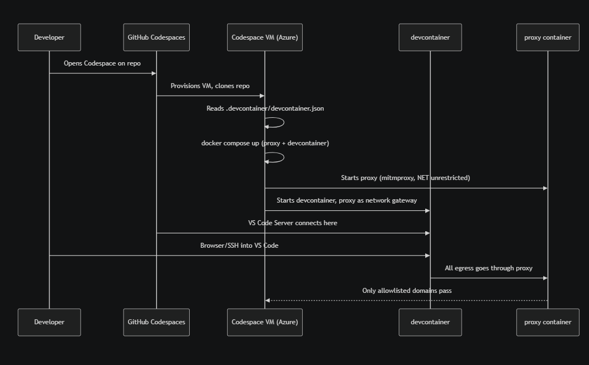
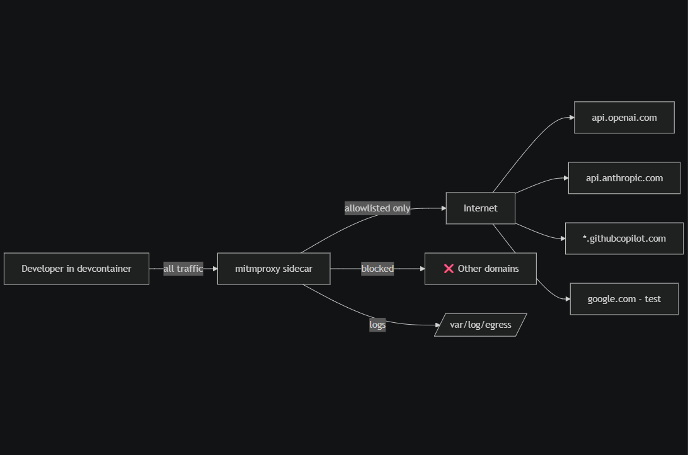

# codespaces-sample




---

## Architecture

```
┌─────────────────────────────────────────────────────────────────┐
│  GitHub Codespace VM                                            │
│                                                                 │
│  ┌──────────────────────────┐    Docker internal network        │
│  │   devcontainer           │◄──────────────────────────────┐  │
│  │  (vscode, no internet)   │                               │  │
│  │                          │    HTTP_PROXY=proxy:7890      │  │
│  │  VS Code Server          │──────────────────────────────►│  │
│  │  Python / Copilot /      │                               │  │
│  │  Claude Code extensions  │                         ┌─────┴──┴──────────┐
│  └──────────────────────────┘                         │  proxy container  │
│          │ read-only                                  │  (mitmproxy)      │
│          │                                            │                   │
│  ┌───────▼──────────────────┐                        │  allowlist.txt    │
│  │  /run/devuser-secrets/   │                        │  egress_filter.py │
│  │  (devsecrets group only) │                        │  ↓                │
│  └──────────────────────────┘                        │  egress.log       │
│                                                      └─────────┬─────────┘
│                                                                │ proxy_external network
└────────────────────────────────────────────────────────────────┼──────────
                                                                 │ internet
                                                       (only allowlisted domains)
```

---

## File Map

### `.devcontainer/devcontainer.json` — Codespaces entry point
The first file GitHub Codespaces reads. It tells Codespaces:
- Use `docker-compose.yml` to build the environment (two containers, not one)
- Connect VS Code as the `vscode` user inside the `devcontainer` service
- Run `initializeCommand` **on the VM** (before containers start) to create the secrets staging directory
- Run `postCreateCommand` **inside the container** after everything is up to install Python deps
- Restrict Claude Code to `/workspace` only via `claude.allowedDirectories`
- Hide `/run/`, `/opt/mitmproxy-certs/`, `/var/log/egress/` from the VS Code file explorer and search

---

### `.devcontainer/docker-compose.yml` — Two-container network layout
Defines two services and the network topology that enforces egress control:

**Networks:**
| Network | `internal: true` | Purpose |
|---|---|---|
| `internal` | yes | Devcontainer ↔ proxy. Docker removes the default gateway, so the devcontainer has **no direct route to the internet** — all traffic must exit through the proxy |
| `proxy_external` | no | Proxy ↔ internet. Only the proxy container is on this network |

**Volumes:**
| Volume | Written by | Read by | Purpose |
|---|---|---|---|
| `proxy_certs` | proxy (mitmproxy auto-generates) | devcontainer (`:ro`) | Shares the mitmproxy CA certificate so the devcontainer trusts intercepted HTTPS |
| `proxy_logs` | proxy (egress_filter.py) | devcontainer (`:ro`) | Developer can read egress logs but not alter them |
| bind: `/tmp/devuser-secrets` | Codespace VM (`initializeCommand`) | devcontainer (`:ro`) | Injects developer secrets read-only |

**Service startup order:**
The `devcontainer` service has `depends_on: proxy: condition: service_healthy`, so it waits until the proxy is confirmed listening on port 7890 before VS Code Server starts.

---

### `.devcontainer/proxy/Dockerfile` — Builds the proxy image
Based on `python:3.12-slim-bookworm`. Installs `mitmproxy>=10.0,<11.0` via pip.  
Copies `egress_filter.py` and validates it compiles at build time (`python3 -m py_compile`).  
Runs: `mitmdump --listen-host 0.0.0.0 --listen-port 7890 -s egress_filter.py`

---

### `.devcontainer/proxy/egress_filter.py` — mitmproxy addon (the enforcement engine)
A Python addon loaded by mitmproxy that intercepts **every** HTTPS request the devcontainer makes:

1. **`request()` hook** — Called before the request leaves the proxy:
   - Looks up the target hostname against compiled regexes from `allowlist.txt`
   - If **not** on the allowlist → writes a `BLOCK` log entry and returns a `403` response to the client immediately (request never reaches the internet)
   - If allowlisted → marks flow as allowed and logs the `REQUEST` entry

2. **`response()` hook** — Called after the real server responds:
   - Skips blocked flows
   - Logs a `RESPONSE` entry including the response body (up to 50 KB)

3. **Log format:** NDJSON (`/var/log/egress/egress.log`). Each line is one JSON object:
   ```json
   {"ts": "...", "type": "REQUEST", "verdict": "ALLOW", "method": "POST",
    "url": "https://api.openai.com/v1/chat/completions", "host": "api.openai.com",
    "headers": {"authorization": "[REDACTED]", ...}, "body": "..."}
   ```
   Auth tokens, cookies, and API keys are **redacted** from logs. Logs rotate at 100 MB, 5 backups.

---

### `.devcontainer/proxy/allowlist.txt` — The egress policy
Plain text, one domain per line, comments with `#`. Wildcards (`*`) match exactly one subdomain label.  
The proxy reads this file at startup. To change allowed domains, edit this file and rebuild the proxy container.

Current allowed categories:
- `api.openai.com`, `*.openai.com` — OpenAI API
- `api.anthropic.com`, `*.anthropic.com` — Claude/Anthropic API
- `*.githubcopilot.com`, `copilot-proxy.githubusercontent.com` — GitHub Copilot
- `github.com`, `*.github.com`, `objects.githubusercontent.com` etc. — git + Copilot auth
- `cli.github.com` — GitHub CLI (`gh`) operations
- `pypi.org`, `files.pythonhosted.org`, `bootstrap.pypa.io` — pip
- `marketplace.visualstudio.com`, `*.vscode-cdn.net`, `*.gallerycdn.vsassets.io` — VS Code extensions
- `google.com`, `www.google.com` — connectivity test only

---

### `.devcontainer/devcontainer/Dockerfile` — Builds the developer image
Based on `python:3.12-slim-bookworm` (Docker Hub — no MCR dependency).

Key actions at **build time** (baked into the image):
- Installs `git`, `curl`, `jq`, `gh` CLI, `ca-certificates`
- Creates `vscode` user (UID 1000) — no sudo, no passwordless escalation
- Creates `devsecrets` group; adds `vscode` to it
- Creates `/run/devuser-secrets/` with `root:devsecrets 750` permissions
- Writes `/etc/profile.d/proxy-settings.sh` (`chmod 444`) — every interactive shell sources this, setting `HTTP_PROXY`/`HTTPS_PROXY` env vars; the file is read-only so `vscode` cannot unset the proxy
- Sets `ENV` Docker variables so proxy is active for VS Code extensions and non-interactive processes too

Key actions at **container start** (via `entrypoint.sh`, runs as root):
- See `entrypoint.sh` below

---

### `.devcontainer/devcontainer/entrypoint.sh` — Runs as root on every container start
Executes before VS Code Server connects. Four responsibilities:

1. **Wait for CA cert** — polls `/opt/mitmproxy-certs/mitmproxy-ca-cert.pem` (written by the proxy container on first run) up to 90 seconds. Once found, installs it into the system trust store (`update-ca-certificates`). Without this, every HTTPS request would fail SSL validation because mitmproxy is intercepting it with its own certificate.

2. **Harden `.devcontainer/`** — transfers ownership of the entire `.devcontainer/` tree to `root` (`chown -R root:root`) and sets all files to `444`, directories to `555`. This means the `vscode` user — even through VS Code's editor — gets `Permission denied` on any write attempt.

3. **Install git pre-commit hook** — writes `/opt/git-hooks/pre-commit` (root-owned) that rejects any commit touching `.devcontainer/` files. Wires it via `git config --system core.hooksPath /opt/git-hooks` (writes to `/etc/gitconfig`, which `vscode` cannot override).

4. **`exec "$@"`** — hands control to `sleep infinity` (which VS Code Server replaces with its own process).

---

### `.devcontainer/devcontainer/post-create.sh` — Runs once as `vscode` after first creation
- `cd`s to the workspace (uses `$CODESPACE_VSCODE_FOLDER` if set, falls back to `/workspaces/codespaces-sample`)
- Runs `pip install -r requirements.txt` through the proxy
- Smoke-tests egress filtering: checks `pypi.org` returns 200 and `example.com` returns 403
- Prints a welcome summary with the log-tailing command

---

### `.devcontainer/devcontainer/devsecret` — CLI for developer secrets access
A bash script at `/usr/local/bin/devsecret`. Since secrets are in `/run/devuser-secrets/` (mode 750, `root:devsecrets`) and `vscode` is in the `devsecrets` group, the developer can read them but Copilot and Claude Code cannot (their `allowedDirectories` config blocks access to `/run/`).

```bash
devsecret list          # list available secret names
devsecret show DB_PASS  # print a secret value
devsecret export        # print export KEY=VALUE lines for valid shell names (eval-able)
```

---

## Startup sequence

```
1. GitHub Codespaces reads devcontainer.json
       │
       ▼
2. initializeCommand runs on the VM
   └── mkdir -p /tmp/devuser-secrets (staged secrets dir)
       │
       ▼
3. docker-compose up
   ├── proxy container starts
   │   ├── mitmproxy starts, listens on :7890
   │   ├── generates mitmproxy-ca-cert.pem → writes to proxy_certs volume
   │   └── healthcheck passes (TCP connect to :7890)
   │
   └── devcontainer starts (waits for proxy healthy)
       ├── entrypoint.sh (root):
       │   ├── waits for CA cert in proxy_certs volume
       │   ├── installs CA cert → update-ca-certificates
       │   ├── chown/chmod .devcontainer/ → read-only
       │   └── installs git pre-commit hook
       └── sleep infinity (replaced by VS Code Server)
           │
           ▼
4. postCreateCommand runs (as vscode)
   ├── pip install -r requirements.txt  (via proxy → pypi.org)
   └── smoke-test: pypi.org → 200 ✓, example.com → 403 ✓
```

---

## Developer usage

```bash
# View live egress log (what AI extensions are actually calling)
tail -f /var/log/egress/egress.log | jq '{verdict:.verdict, url:.url, method:.method}'

# Access a secret
devsecret list
devsecret show MY_API_KEY

# Load secrets into current shell session
eval "$(devsecret export)"

# Rebuild the container after devcontainer config changes
gh codespace rebuild
```

---

## Security properties

| Property | Mechanism |
|---|---|
| Devcontainer cannot reach the internet directly | Docker `internal: true` network — no default gateway |
| Blocked domains get hard 403 | mitmproxy `egress_filter.py` `request()` hook |
| All HTTPS bodies logged | mitmproxy MITM — CA cert installed in devcontainer |
| Auth tokens never logged in plaintext | `_redact_headers()` in `egress_filter.py` |
| Developer can read secrets, AI extensions cannot | `/run/devuser-secrets` mode 750 + `claude.allowedDirectories` |
| `.devcontainer/` not editable from inside | `chown root` + `chmod 444` in `entrypoint.sh` |
| `.devcontainer/` changes not committable | git system pre-commit hook in `/opt/git-hooks/` |
| No sudo escalation | `vscode` user created without sudo |
| Proxy env vars always active | `/etc/profile.d/proxy-settings.sh` (444) + Docker `ENV` |
